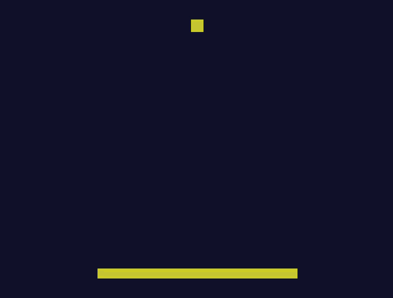

# ⚙️ Motor de Físicas 2D en C++

Un proyecto personal para aprender los fundamentos de la ingeniería de software y el desarrollo de videojuegos construyendo un motor de físicas 2D desde cero con C++ moderno y SDL3.

<div align="center">

</div>

## 🚀 Acerca del Proyecto

Este repositorio documenta mi viaje en la construcción de un motor de físicas 2D. El objetivo principal no es crear el próximo gran motor comercial, sino profundizar en conceptos de bajo nivel, tales como:

* Álgebra lineal aplicada a la física de juegos.
* Arquitectura de software para sistemas en tiempo real.
* Gestión de memoria y optimización de rendimiento en C++.
* Implementación de algoritmos de detección y respuesta de colisiones.

Este proyecto sirve como una pieza fundamental de mi portafolio, demostrando mi capacidad para abordar problemas complejos y mi pasión por la tecnología detrás de los videojuegos.

## 🛠️ Tecnologías Utilizadas

* **Lenguaje:** C++17
* **Sistema de Compilación:** CMake
* **Librería Gráfica:** SDL3 (para renderizado y manejo de ventanas/eventos)

***

## 🗺️ Roadmap del Proyecto

El desarrollo del motor se completó a través de varias fases incrementales.

-   [x] **Fase 0: Entorno y Ventana Básica**
    -   [x] Configuración de proyecto con CMake e integración de SDL3.
    -   [x] Creación de una ventana y un bucle de juego con timestep fijo.
-   [x] **Fase 1: Fundamentos Matemáticos**
    -   [x] Implementación de una clase `Vector2D` robusta con sobrecarga de operadores.
-   [x] **Fase 2: Arquitectura del Motor**
    -   [x] Diseño de la clase `Body` para representar objetos físicos.
    -   [x] Diseño de la clase `World` para gestionar la simulación.
-   [x] **Fase 3: Movimiento e Integración**
    -   [x] Implementación del integrador de Euler para simular el movimiento.
-   [x] **Fase 4: Detección de Colisiones**
    -   [x] Algoritmos de colisión AABB contra los límites del mundo.
-   [x] **Fase 5: Respuesta a Colisiones**
    -   [x] Implementación de resolución de colisiones entre cuerpos basada en impulsos, conservando el momento lineal.
    -   [x] Resolución de la penetración para evitar que los objetos se superpongan.
-   [x] **Fase 6: Optimización y Mejoras**
    -   [x] Implementación de un **Quadtree** para la partición espacial, optimizando la detección de colisiones de O(n²) a O(n log n).

***

## 🧠 Principales Aprendizajes

Este proyecto fue un profundo ejercicio de aprendizaje práctico. Los conceptos clave que solidifiqué incluyen:

* **Arquitectura de Software:** Diseño de un sistema desacoplado mediante clases con responsabilidades únicas (`Vector2D`, `Body`, `World`, `Quadtree`), y la importancia de separar la declaración (`.h`) de la implementación (`.cpp`).
* **C++ Moderno:** Uso práctico de características como la sobrecarga de operadores, `std::vector`, punteros inteligentes (`std::unique_ptr`) para la gestión automática de memoria, y la importancia de `const` para escribir código seguro.
* **Física para Videojuegos:** Implementación de conceptos físicos desde cero, incluyendo la integración de Euler, la Segunda Ley de Newton ($F=ma$), la conservación del momento lineal, y el coeficiente de restitución para simular rebotes realistas.
* **Optimización de Rendimiento:** Comprensión y solución del problema de complejidad cuadrática `O(n²)` en la detección de colisiones mediante la implementación de una estructura de datos de partición espacial como el Quadtree.
* **Ciclo de Desarrollo:** La importancia de un sistema de compilación robusto (CMake) y la metodología de **probar, depurar y tunear** variables para lograr el comportamiento deseado en una simulación.

***

## 🔮 Mirando Hacia Adelante

El motor es ahora una base sólida sobre la cual se pueden construir muchas características nuevas. Los próximos desafíos podrían incluir:

* **Nuevas Formas de Colisión:** Añadir soporte para **círculos**, lo que implica escribir nuevas rutinas de detección (círculo-círculo, círculo-rectángulo) y resolución.
* **Interactividad con el Usuario:** Utilizar los eventos de SDL para permitir al usuario **crear objetos con un clic** o **arrastrarlos** por el mundo con el ratón.
* **Física de Rotación:** Expandir la clase `Body` para incluir `ángulo`, `velocidad angular`, `torque` y `momento de inercia`, permitiendo que los objetos giren de manera realista al chocar.
* **Construir un Juego:** Utilizar el motor como framework para desarrollar un juego simple, como un clon de *Asteroids*, un juego de billar o un sandbox de física.

***

## 🎮 Cómo Empezar

Sigue estos pasos para compilar y ejecutar el proyecto en tu máquina local.

### **Prerrequisitos**

Asegúrate de tener las siguientes herramientas instaladas:
* Un compilador de C++ que soporte C++17 (ej. GCC, Clang, MSVC).
* [CMake](https://cmake.org/download/) (versión 3.10 o superior).

La dependencia de **SDL3** está incluida en el repositorio (`/vendor`), por lo que no se requiere instalación manual.

### **Instrucciones de Compilación y Ejecución**

1.  **Clona el repositorio:**
    ```sh
    git clone [https://github.com/mgarridoch/PhysicsEngine.git](https://github.com/mgarridoch/PhysicsEngine.git)
    cd PhysicsEngine
    ```

2.  **Genera los archivos del proyecto con CMake:**
    ```sh
    cmake -B build
    ```

3.  **Compila el proyecto:**
    ```sh
    cmake --build build
    ```

4.  **Ejecuta la aplicación:**
    El ejecutable se encontrará dentro de la carpeta `build/`.
    > **Nota para Windows:** Puede que necesites copiar el archivo `SDL3.dll` (ubicado en `vendor/SDL3/lib/x64`) a la misma carpeta donde se generó el `.exe` (ej. `build/Debug/`).
    ```sh
    # En Windows (ejemplo)
    ./build/Debug/PhysicsEngine.exe
    
    # En Linux/macOS
    ./build/PhysicsEngine
    ```